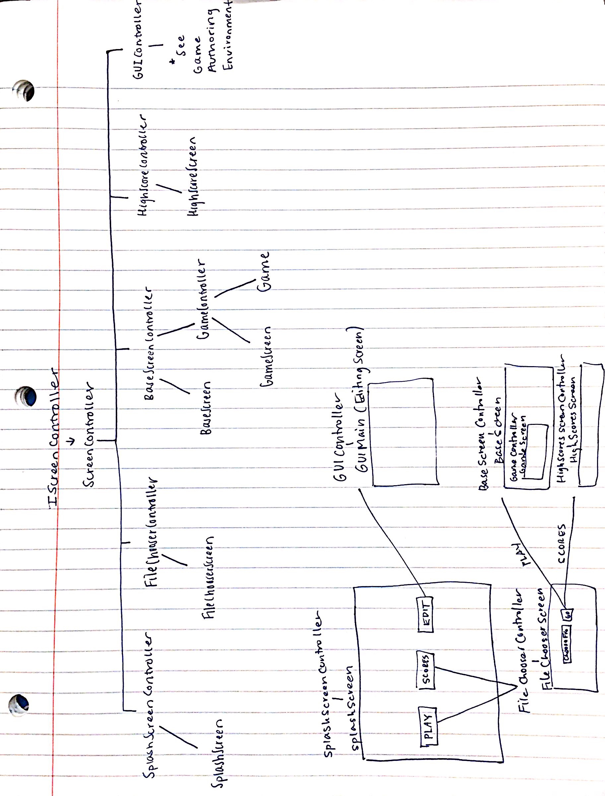
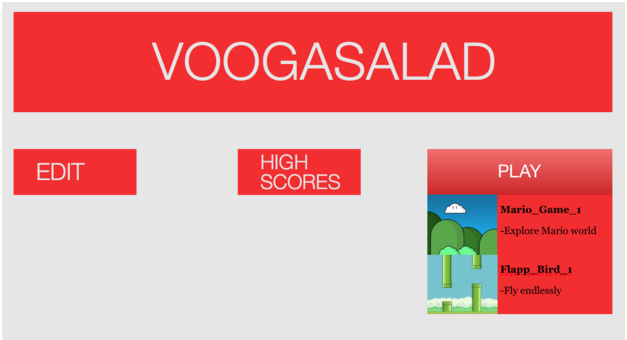
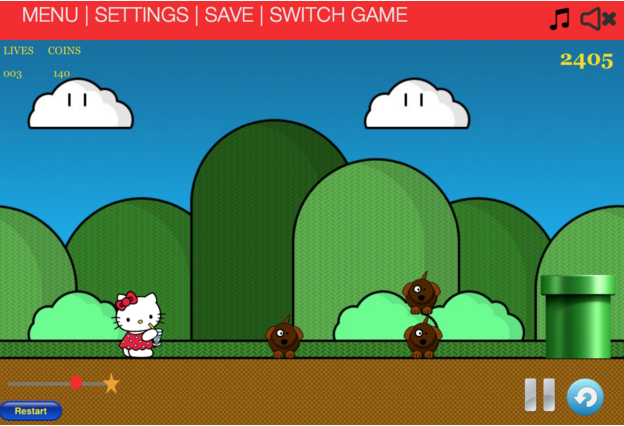

# VOOGASalad Design - The Loop's Goat Cheese Salad

*Justin Bergkamp, Michelle Chen, Michael Figueiras, Blake Kaplan, Stephen Kwok, Annie Tang, Carine Torres, Colette Torres, Bobby Wang, Amy Zhao*

## Introduction

This program is intended to allow users to run any type of scrolling platform game they create. The 2D scrolling platformer genre is unique in that it allows the scenes to scroll either vertically or horizontally and it allows actors in the scene to both be controlled by the player and interact with each other. Thus, our design will need to support flexibility in scrolling direction and a wide range of actor behaviors.

 Our primary design goals are to be as flexible as possible in letting users determine “rules” for their games, by means of some sort of trigger signal (e.g. a mouse click, a key press, a collision) and resulting executable action (e.g. move a character right, fire a missile from the character, etc.).  This means we will try to create a hierarchy for this architecture where the most fundamental components of the game are closed so as to very clearly define the role, say, a trigger plays in the flow of the game while allowing for their extension to support different types of triggers as games are designed to be more and more complex.  We will also try to make our design as flexible as possible to support the continued addition of game objects to be rendered on the game screen by creating a hierarchy of object types that hold all basic properties required for their rendering on the screen and management as actors capable of potentially responding to triggers in the game and consequently executing actions.

The program strives to be a user-friendly environment in which each screen’s purpose is clear and distinguished from others. The splash screen will facilitate transitions to other screens, and anything that is dependent on a single game choice is prefaced with a file selection screen to make this process as orderly as possible. All screens will have the necessary buttons to navigate to other areas of the program so extending our design to include more differentiated screen possibilities is accounted for.

## Design Overview

Our overall design is divided up into the game authoring environment, game engine, game player/data, and shared gui.

#### Game Authoring Environment

The game authoring environment will be separated into three components, using the Model-View-Controller pattern.

**authoringenvironment.model**: The authoring environment is comprised of two main types of objects: editable elements and editing elements (which includes editing environments). The model component of the authoring environment contains interfaces for each of these types of objects, providing a framework for how IEditableGameElements (e.g. Game, Level, Actor) may be modified and passed around by IEditingElements (e.g. GUILevelEditingEnvironment, GUIMainScreen). IEditableGameElements all contain methods for setting and getting a name to identify them, and for getting and setting their ImageViews to visualize them.  It also includes an interface IAuthoringActor which determines the fields of each Actor that the authoring environment can edit.

**authoringenvironment.view**: The purpose of this module is to contain all GUI code regarding JavaFX features and surface level visuals that are specific to the authoring environment. More generic GUI elements are shared in the gui.view package. All of the GUI elements specific to the authoring environment implement either IEditingElement or IEditingEnvironment, and their purpose is to provide an easy, visual way for the user to interface with the game authoring environment via TextFields, ComboBoxes, ScrollPanes, Buttons, as well as larger components such as tabs to display available actors and level attributes. When a new editable element is set (e.g. when you switch to editing a different level or a different actor), the editing elements’ values will be updated to reflect the editable element that is currently being edited so that the user can see the data that is currently set and stored for each element they’ve created.

**authoringenvironment.controller**: This module allow for communication between the model and the view. It contains one Controller class and a Main for testing. The Controller class controls the flow of use by determining how and in response to what the user can switch between the MainScreen, the ActorEditingEnvironment, and the LevelEditingEnvironment. It also stores the current Game object so that it can pass data to the view. 

#### Game Engine

We divided up our game engine functionality into seven individual parts. The game engine is primarily broken up into a hierarchical structure of Game to Level to Actor to Rule to Action/Trigger/Attribute and collision detection (see UML for more detail about module relation). We will now discuss individual module responsibilities in the context of their purpose with regards to the program's functionality and how they collaborate with each other, focusing specifically on each one's API:

**Game**: In our design, the Game is the package of Levels and Actors. It communicates with the Game Controller, which, in turn, communicates with the Game Player. 

Since the Game will also be the point of interaction with the Game Controller, it will be the pathway for relaying events. In our thinking, we acknowledged that there are some Actions that will occur with every timeline step. We will refer to these as “tick-triggered” Actions. Other Actions will be triggered by a specific user performed triggers such as key presses, mouse clicks, or collisions. We decided to generalize these different events so that they are all treated in the same way. This way, it will be simple to create new Triggers, which will always be modular. When it receives a trigger of any sort, the Game passes it into the current Level object that is being played.

**Level**: Each level of the game will be represented on the back end as a Level object. In essence, each Level object is a package of Actor objects. As we see it, the a level will contain a map from String (the string representations of Triggers) to a list of Actor objects. We chose to design it this way for a specific reason. Such a design prevents us from having to check each Actor’s rules with each timeline step. Especially for destination based games, performing such an O(n) operation would become very costly with computations. Instead, we decided that we would only reference Actors that respond to a specific Trigger for any given step. This saves us a great deal of computation.

The series of events upon receiving a Trigger object would be to first get the associated list of Actors. Then we would iterate over these Actors calling the `performActionsFor(String triggerString)` method. Doing so causes the Action responses within each Actor. This design allows us to efficiently perform Actions that are specific to each Actor.

**Actor**: Each actor is essentially a package of Rules organized as a map. This map will have a string (representing a Trigger) as a key and a list of Action objects as a value. As we mentioned earlier, each Actor will contain a `performActionsFor(String triggerString)` method. This method will take in a String representing a trigger, get the appropriate Action procedures from the map and loop over them to execute them.

This design allows us to keep the Triggers and the Actions very modular. Every object in the level will be represented by an Actor. When creating a game, a user can simply plug in Rule pairings to define Actor behaviors. Our design is conducive to a great deal of customization.

Furthermore, our Actor class with contain an ImageView object. This will allow us to easily attach visual elements to the Actor objects so that they can be easily displayed in the player.

**Rule**: We decided to use a Rule class to hold pairs of Triggers and Actions. For our purposes this will help to keep these pairing together which is critical to functionality. In the Actors and Levels, we break these Rules down into maps, but for communication’s sake, the Rule objects will be useful.

**Action**: Any change that happens in a Game works via Action objects. As described earlier, within an Actor, a Trigger string is linked to a list of Action objects. Each Action will have a specific Actor passed into its constructor along with any necessary arguments to perform the Action. Actions are executed by calling the `perform()` method, which is common to each Action object. The Action will cause a change to the Actor, often via the `move(double distance, double direction)` method that the Actors will all have. The change will be reflected on the front end when it receives a Node with a different set of coordinates or exhibits a different change. We will be using at least one Action abstract class to place all shared functionality in a single place. Each Action object will extend the Action abstract class to inherit this predefined functionality.

**Trigger**: Triggers are used to communicate event from the front end to the back end. Each Trigger represents a particular event (e.g. ClickTrigger or KeyTrigger). Each trigger has a boolean `evaluate(IActor myActor)` method that allows for additional conditional checking. In the case that, the conditional evaluates to true for a particular actor, the Actor’s specified Trigger response is set off. It is also important to note that the `getMyKey()` method for Triggers returns a string that is used in Level and Actor maps to execute the proper response.

**Attribute**: In our design, we make the distinction between Trigger/Action workflows and Attribute/Action workflows. We concluded that Triggers would be used for event driven actions while Attributes would be used to handle value driven actions. We created objects called Attributes that have a current value, a trigger value, and an associated Action for when the current value and the trigger value are the same. This will be useful for implementing values like health and points. We also specify the type of Attribute using the AttributeType enum.

**Collision Detection**: This object performs collision detection for each actor. It will perform an O(n^2) collision detection by checking each Actor against all others. Should a collision be detected, using the Actor’s Bounds, the collision then must be resolved. We implement a Minkowski Sum algorithm for determining which side of an object on which the collision is occurring. In order to actually resolve the collision, we call on the Actor to perform the Action is has linked to the collision. We are able to do this because we treat the different collision types as Triggers. The only public method in the CollisionDetection class is detection(), which receives a List of Actor objects as parameters. 

**Physics Engine** This class handles calculating and assigning new positions based on positional attributes and movement vectors. It receives Actor object via movement specific methods like moveRight/jump, and these methods then apply a set force that affects and updates the Actor's position and velocity variables. The update method in the physics engine does a lot of work for our class, determining whether or not the actor is in the air and applying relevant forces on it to calculate the next horizontal and vertical velocities/positions. Certain methods in the physics engine correspond to actions that call them, and differ based on the actor.

#### Game Player / Data

There are several high-level modules to the game player, which are each implemented by individual classes:

**IScreenController**: This module is a public interface that contains the basic methods necessary to implement changes between controllers.

**ScreenController**: This is an abstract class that implements IScreenController. It contains code that all subsequent controller classes can utilize.

`GameController` is the main controller class for the game player. It has various methods for starting and ending games, and it performs all of the setup/teardown of the games themselves. In particular, the `createGame()`, `createGameView()`, `setGame()`, `setGameView()`, `initialize()`, `begin()`, `update()`, `checkInteractions()`, `cleanUp()`, and `endGame()` methods are all within this class. Overall, this class has control over almost every other class within the Game Player.

The `ISplashScreen` is an interface, and a classes which implements this interface will serve as the main splash screen for our application. It has four main functions: `play()`, `edit()`, `openHighScores()`, and `openIndividualHighScores()`. `play()` opens up a menu of types of games to play, and once the user selects an individual game type, the game engine is instantiated and the scene is switched over to the `BaseScreen`. `edit()` opens up the game authoring environment and switches over the display. `openHighScores()` results in a menu opening where each game type is shown with its high score next to it. Clicking on an individual game inside that menu reuslts in `openIndividualHighScores()` being called, which opens up a list of all the high scores.

**Information Parsing**: This module is responsible for loading the save games from disk files to the program. It consists of three main classes:  `IParserController`, `GameXMLParser`, and `EditXMLParser`. `IParserController` serves as the controller for this class, and it determines whether the information loaded is for gameplay or for editing. The  classes for loading the XML for gameplay and editing are the `GameXMLParser` and `EditXMLParser`, respectively.

**Information Storing** On the flip side of the parsing module, this module is responsible for saving games to the disk. There is a lot of parity between the parsing and storing modules. The storing module consists of three main classes:  `ICreatorController`, `GameXMLCreator`, and `EditXMLCreator`. `ICreatorController` serves as the controller for this class, and it determines whether the information saved is for gameplay or for editing. The  classes for saving the XML for gameplay and editing are the `GameXMLCreator` and `EditXMLCreator`, respectively.

**HighScores**: This is implemented by several classes. A `HighScoresController` class has two methods: `getHighScores()` and `viewHighScores()`. The former is mediated by a `HighScoresParser` class, which de-serializes an XML file into a map Java object, and the latter is displayed on a `HighScoreScreen` class.

**Display**: This module is responsible for displaying all of the actors and background objects on the gameplay area screen. It consists of the `BaseScreen`, `HUDScreen`, `GameScreen` and `MenuScreen` classes. `BaseScreen` is the base upon which other objects can be added with `addComponents()`. `HUDScreen` is a dynamically updating (with the `update()` function) overlay on top of the `BaseScreen` which shows relevant information such as the number of lives remaining and the current score to the player. `GameScreen` has two main functions: `addActor()` and `handleScreenEvent()`. The former function deals with adding various actors to the current displayed area, and the latter deals with handling what happens if an on-screen event happens. This information may get sent back to the game engine for further processing. `MenuScreen` is responsible for saving the current game, switching games, and returning to the main menu, through the `saveProgress()`, `switchGame()`, and `returnToSplash()` functions respectively. As more extensions get added to this project, the `MenuScreen` may have further increased responsibilities.

#### GUI
This module will be shared across all front-end features. There is a parent interface called IGUIElement.java, which contains one public method: Node createNode();
to create the specified GUI element and return it as a Node. This Interface will be implemented by many subclasses, each of which is separated by its JavaFX functionality. Visual features in the authoring environment will be created as extensions of these subclasses or as combinations of these subclasses. There will also be a GUIFactory class that utilizes the Factory design pattern to instantiate each of the GUI elements in this hierarchy. Finally, there will be an IGUI.java class that sends information from the view to the model, through the controller. Essentially, this class will set up the JavaFX Scene, which will be staged by the controller, which will pass this information to the model, where the data representation of the authoring environment will be updated based on the user input received by the view. 

## User Interface

#### Authoring Environment

The authoring environment's user interface is separated into three main screens. The first is the main screen, where the user will see multiple tabs leading to either the project info (title, description, etc.), current scenes/Levels, and available Actors. Within the scenes/levels tab, the user can double click on the scene/level to enter the level editing environment. Within the Actors tab, the user can double click on the Actor to enter the Actor editing environment. The toolbar at the top will be present for all views of the GUI, where the user can return to “home”, i.e. this main screen, look at a drop down menu of current scenes, or save the progress of their design.

This second image shows the Level editing environment. On the left pane is an inspector section, which is separated into two tabs: Game and Scene. In each tab, the user can see attributes of either the game or the scene. The user can also view available Actors that will be able to be clicked and dragged onto the screen in the right pane. The right pane of the Level editing environment is where the user can add items and view their design as it is created. There will also be a stop and play button below this pane where the user can simulate their game as it is.

Finally, the third image shows the Actor editing environment. On the left pane, the user can see the image that the Actor is represented by, as well as its attributes (name, position, size, etc.). Below this is the same library that was in the scene editing environment. On the right pane of this environment is where the user can click and drag combinations of rules and behaviors that the Actor must adhere to.

#### Game Engine/Player

The User Interface will include a splash screen as the starting location for the user input. From here, the user will have the option to choose between three buttons, one to enter the GameAuthoringEnvironment, one to view HighScores, and one to play a game. The “Create” button will transition to the Game Authoring Environment, which is described above. From there, the user can save the game specifics to a new file or overwrite an older one and then return to the splash screen. The ‘Play’ button will take the user to an intermediary screen which contains a ComboBox that allows the user to choose a file to play and then launch the base screen. In the base screen, there will be a couple of ways for the user to interact with the environment. First, there will be a toolbar with buttons to click on which will accomplish high-level operations like switching games without quitting, replaying a game, or saving progress. There will be a heads up display that will keep track of time-sensitive data like the user’s position and proximity to the finish line or destination (in bounded scrolling games, like SuperMario but not Flappy Bird) as well as the score. The HUD will also keep track of health status and other player variables. The actual game will be displayed on a subscene which will be located in between the ToolBar and the HUD display. Actors, background images, and other game items will all be located and confined to this area.

Erroneous situations that are reported to the user: invalid file formats (for images, sound files, and XMLs), invalid values entered for attributes of the Level or the Actor (e.g. for an Actor’s x-position, it cannot be a boolean). In terms of erroneous situations, the user interface will handle the cases where the user inputs an improperly formatted file name or the name of a preexisting file (in which case it will ask the user for permission to overwrite this file). These errors will be reported to the user using JavaFX alerts.

## Design Details

#### Authoring Environment

**authoringenvironment.model**: The model component of the authoring environment sets and updates the editable element that each environment is editing. It contains methods `setEditableElement()` to pass the objects to be modified, and the IAuthoringActor interface also determines which fields of the Actor can be modified from the authoring environment. Our current design allows for the user to edit the rules for each actor, its position, its name, its image, its size, its ID, and whether or not it is a main, playable character. This can be extended easily by adding new methods to the IAuthoringActor if we want to give the user greater flexibility in how they want to design their actors.

**authoringenvironment.view**: The view component of the authoring environment lays out what the designer sees as the user interface, based on information gleaned from the model. The view will utilize code from the GUI module regarding JavaFX features and surface level visuals. It will control the placement of the GUI elements such as ComboBoxes, TextFields, Buttons, popup Dialogs, error messages, TableViews, ImageViews, and so on, through an inheritance hierarchy of GUI elements. The view will also determine the layout of the GUI regarding uses of BorderPanes and TabPanes and how each component of the GUI will be nested within each other. Visual features in the authoring environment will be created as extensions of classes or as subclasses from the GUI module. This package will contain separate classes representing the authoring environment’s main screen, its level editing environment, and its actor editing environment, as well as any sub components that go into these major visuals (element library, inspector, actor rule creator, etc.). 

**authoringenvironment.controller**

The Controller class serves as the controller for the authoring environment and allows the user to move between level editing, actor editing, and main screen views of the authoring environment. Each editing environment is only instantiated once, so the Controller also sets the Actor or Level to be edited when switching to an editing environment. The Controller also allows the user to save and load a game, as well as return to the game player’s splash screen. The Controller also allows the user to retrieve created Levels and Actors.

#### Game Player / Data

Describe how each module handles specific features given in the assignment specification, what resources it might use, how it collaborates with other modules, and how each could be extended to include additional requirements (from the assignment specification or discussed by your team). Note, each sub-team should have its own API for others in the overall team or for new team members to write extensions. Finally, justify the decision to create each module with respect to the design's key goals, principles, and abstractions.

This program is intended to allow users to run any type of scrolling platform game they create. The 2D scrolling platformer genre is unique in that it allows the scenes to scroll either vertically or horizontally and it allows actors in the scene to both be controlled by the player and interact with each other. Thus, our design will need to support flexibility in scrolling direction and a wide range of actor behaviors.

Our primary design goals are to be as flexible as possible in letting users determine “rules” for their games, by means of some sort of trigger signal (e.g. a mouse click, a key press, a collision) and resulting executable action (e.g. move a character right, fire a missile from the character, etc.).  This means we will try to create a hierarchy for this architecture where the most fundamental components of the game are closed so as to very clearly define the role, say, a trigger plays in the flow of the game while allowing for their extension to support different types of triggers as games are designed to be more and more complex.  We will also try to make our design as flexible as possible to support the continued addition of game objects to be rendered on the game screen by creating a hierarchy of object types that hold all basic properties required for their rendering on the screen and management as actors capable of potentially responding to triggers in the game and consequently executing actions.

**High-Level Controller**: This high-level controller is responsible for prompting the behavior of all other modules in the Game Player / Data sector. It would use relatively few external resources in the form of XML configuration files. Its performance is not dependent on the correct performance of any other class, in that other classes having errors will not cause this class to have an error. However, it is likely that incorrect performance of other classes would negatively impact the overall application. This application launches either the game editing environment, game play environment, or the high score environment, depending on the user selection. This module can be extended to include additional requirements by having different classes implement the `ISplashScreen` interface. Those implementing classes can have different properties that would make it easier to extend our original design. As stated in our introduction, our key goal is flexibility - the liberal use of interfaces in this module are a way to achieve that goal.

**Information Parsing**: The information parsing module is responsible for loading information from XML files and de-serializing them to objects. This module is dependent on correctly formatted external XML files. Its performance is dependent on the correct performance of the Information Storing module, as it is unlikely that we will be writing XML files by hand. This module is launched by the High-Level Controller module, and the information that it extracts is passed on to either the Game Authoring Environment or the Game Player Environment.  This module can be extended to include additional requirements by extending the `IParserController` class. Those implementing classes can have different properties that would make it easier to extend our original design. As stated in our introduction, our key goal is flexibility, both in terms of gametype and in terms of adding additional features - the liberal use of interfaces and generalized XML deserialization tools (such as XStream or Groovy) should allow for maximized flexibility in the future.

**Information Storing**: The information storing module is responsible for storing information to XML files and serializing them from objects. This module is dependent on the correct functioning of an external serialization library, such as Groovy or XStream. Its performance is not directly dependent on the correct functioning of any other module. This module can be extended to include additional requirements by extending the `ICreatorController` class. Those implementing classes can have different properties that would make it easier to extend our original design. As stated in our introduction, our key goal is flexibility, both in terms of game type and in terms of adding additional features - the liberal use of interfaces and generalized XML serialization tools should allow for maximized flexibility in the future.

**HighScores**: The high scores module is responsible for saving and loading the high scores with regard to each game created within the game authoring environment. This module is dependent on the correct functioning of the game engine, since it needs to get the score from the game engine at the end of a game. Otherwise, it is an entirely self-dependent module. The high score information within this module is passed to the display when needed. Our key goal is flexibility here - however, since there are relatively few "twists" on a high score, there is not as big of a need for flexibility when it comes to saving high scores.

**Display**: The display module is responsible for displaying the state of the game engine in the game play area, and for offering several buttons that allow the user to save/load/switch games, set game preferences, and return to the main menu if desired. This is by far the most complex module, and this module is relatively reliant on the correct performance of other modules. It depends on the game engine to pass it correct information about the current state of the game, so that it can correctly display the game state. It is instantiated by the high-level controller. It expects the information parsing/storing modules to work so that its buttons for saving/loading games are actually functional. Having said that, the Display module will not completely cease to function if the other modules fail - it will simply have certain non-functional components. This module has ample room for extension - there can be multiple classes that extend the existing Display classes, such that additional HUD components, etc. can be added to the display. Thus, we fulfill the main goal in our introduction of flexibility.

## Example Games

**Flappy Bird**

In the game Flappy Bird, the user attempts to dodge obstacles by moving an actor up and down as the screen scrolls horizontally until a collision occurs between the actor and an obstacle. The game authoring environment allows for this type of game by giving the author the option to generate an infinitely-scrolling scene within the level editing environment. The author then has the option of dragging and dropping actors created in the actor editing environment into that scene or level. The author may also decide how frequently each actor appears on that level (as it would be impossible for the author to place obstacles indefinitely). Each of the actors will come with a set of defined rules for responding to given triggering events (this will be implemented as a Rules class with a TriggerEvent that results in the invoking of an Action). In the case of Flappy Bird, the actors to be created will include the user-controlled player and obstacles such as pipes. Each obstacle will likely have a single Rule, stating that whenever the TriggerEvent Collision occurs between the user and the obstacle, the GameEnd Action is invoked. For the user-controlled player, a Rule specific to that actor may be that whenever the trigger event KeyPressUp occurs, the MoveUp Action is invoked. Any other responses to events such as mouse clicks, key presses, or collisions, can be added to an Actor’s list of rules in this way. Then, when the game runs, each game loop will involve iterating through each actor’s list of Rules to check for TriggerEvents and making any responses happen as needed.

Flappy bird is unique from many platform scrolling games because it has infinite scrolling (until the player loses). Every keyframe, the game player simulates scrolling by updating the x positions of each obstacle on the screen and the y position of the bird on the screen. This creates the illusion of scrolling, even though the bird is moving on a stationary stage (not the other way around).

Since the game is infinitely scrolling, the game player would save the current score, the y position of the bird, the total distance it traveled, and the bird’s relative distance from the start of the current “level” in a save state. These four pieces of data, along with preferences like whether music is on/off, are all the information that is necessary to recreate a game from an XML.

**Super Mario**

In the game Super Mario, the user traverses a predefined scene until he or she reaches some destination that enables him or her to advance to the next level. Along the way, the user must break down obstacles, defeat enemies, and watch out for traps. Super Mario differs from Flappy Bird in that the scene does not scroll indefinitely. Rather, there is a set ending point and every obstacle on a given level must be added manually by the author. The author will be given the option to build whole levels in the level editing environment. From there, creation of the scene is exactly the same as it is for Flappy Bird. The level editing environment will display actors the author has already created, and those actors simply need to be dragged and dropped into the desired location on the scene. One difference between Super Mario and Flappy Bird is that Super Mario consists of multiple levels instead of just one. To accommodate this, the Game Authoring Environment will have a Main Screen that allows the author to see all currently created levels and actors. By clicking on any level, the author will then be sent to the level editing environment to edit the level he or she clicked on. The Main Screen will also have buttons allowing the author to create new levels or actors. Having multiple levels also means the Game Engine needs some way of knowing when to switch scenes. To account for this, the author can define some actor that serves as the target destination which has the Rule that when the user and target collide, the NextLevel Action is invoked.

Our game engine design enables this type of game with level progression through our very extensible hierarchy of game objects that can engage in a variety of triggers for a wide range of resulting actions.  For example, by extending our Actor class, we could create, say, an InvisibleActor class and place it at the end of the level’s scene such that when the main character actor collides with this invisible actor object, the collision (Collision could be an extension of our Trigger class) triggers a level change (LevelChange could be an extension of our Action class).

The HUD will display an outline of the route for the level with the main target being the user’s player and the end of the route will coincide with the location of the target actor that, upon collision, will transition to the next level. This way the user will be able to determine how far they are from the end of the level. In terms of design, the HUD will be an observer of the game engine’s player location and will update its relative position according to the ratio of the player’s x location to the final destination or actor’s x location. This is supported by our design with the update() method of the HUDScreen class and is compatible with the GameLoop.

**Doodle Jump**

Doodle Jump is similar to Flappy Bird in that both require infinite scrolling. However, Doodle Jump scrolls vertically instead of horizontally, which the Game Authoring Environment will enable. Another difference is that projectiles are present in Doodle Jump. To account for this, the actor editing environment will allow authors to create the projectile with attributes and Rules as with any other actor. However, the actor will not be dragged and dropped into a scene in the level editing environment. Rather, the initial position of the projectile will be determined by the Game Engine while the game is running.

Our design enables this type of infinitely scrolling game with an action occurring at a regular interval because of our flexible Trigger and Actions classes.  As in Flappy Bird, we could make use of a Tick subclass of Trigger contained in our main character actor and constantly trigger Tick at every step through our game loop, then have Tick map to a Jump subclass of Action.  At the same time, every other actor (besides the main character and potentially background) would contain a rule mapping a Tick trigger to a MoveDown action.  The MoveDown action’s perform() method would be set to move the actor down some constant so that it appears as if the game is scrolling down.

With regards to the design of the game data aspect, our XML saver will still allow for the functionalities specific to Doodle Jump.  To address the behaviors particular to Doodle Jump (i.e. a collision with other actors doesn't mean "game over" like it does in Flappy Bird...a player landing on one of the actors actually means the opposite, that the game should continue), merely, the rules property file referred to in an actor's section in the XML file will simply be different for Doodle Jump versus Flappy Bird or Mario.  That rules property file would also catch the unique scrolling of Doodle Jump that has movement occur with "up" and "down" keys because those would be the keys corresponding to movement actions in the file (rather than "left" and "right" keys, say). The XML creator only writes in a filepath given by the authoring environment, so the avoidance of hardcoding of a file allows for an acknowledgement of behaviors specific to Doodle Jump.  The design choice to use property files to connect interactions with executable behaviors also facilitates that flexibility because reflection can then be used to generically execute game behaviors regardless of the actual TriggerEvent/Action pair.  The unique background for Doodle Jump would be acknowledged in the establishment of a "background-image" section in each level's section created by the XML creator too.

Our design of the game player also facilitates Doodle Jump's unique functionalities. In particular, the infinite scrolling capability is supported by the game player's design inclusion of a game loop since the portion of the game loop that "updates" "checks interactions" and "cleans up" the screen will allow actors and backgrounds to appear to be scrolling by merely cycling through different x and y position on the screen.  Those changes are rendered by that latter portion of the game loop.  

## Design Considerations

#### Authoring Environment

In designing our authoring environment, our main concerns were where to store information about the actors and levels that the user creates, and how to store them in a format that allows them to be easily saved and loaded into the game engine.

We wanted to create a class that provided a common point of access to all the level and actor information so that the Game Data group could save all necessary information easily and to minimize dependencies between the authoring environment and other components. Two options we considered were to create a AuthoredData class that held the information, or to store it in the MainScreen class. While an AuthoredData class could possibly make our design more readable, it is also not very functionally useful to have a class that does little more than hold data, which is why in the end we decided to have each Actor store its own information, and each Level store its own information, but keep references to each ILevel within the MainScreen, as well as references to all IActors, and have each ILevel have references to every IActor that has been added to it. However, after learning in lecture about XStream, we ultimately decided that these interfaces were not necessary.

We also discussed at length how to store all of the relevant game information into one object that can be easily saved and loaded via XStream. We had to consider how the Actors, Levels, and Game Info would all be organized within the Game, and ultimately decided that a single Game object should hold its own GameInfo and its Levels as a list in the order that they should be played. The Game should also hold a list of all existing Actors that have been created, and each Level should hold its own list of Actors that are used in that particular Level. 

Another key component of our design that we discussed was how to switch between a MainScreen, a LevelEditingEnvironment, and an ActorEditingEnvironment. We considered using a MainScreen as an interface between the LevelEditingEnvironment and an ActorEditingEnvironment, but ultimately decided that no single screen should hold other screens. Thus we decided on creating a Controller to interface between the three.

#### Game Data/Game Player

In this preparation process, we had several conversations about the interpretation of XML data and how to pass file information to and from the Game Authoring Environment and the Game Player / Game Engine. We initially felt the need to be able to parse the data by information category and then format it to the GameAuthoringEnvironment’s specifications of a map of information attributes and a list of actors. However, this limits the extension potential of this component. After Professor Duvall introduced us to XStream, we opted to use this feature since it allows us to serialize and deserialize Java objects without cognizance of the particular properties associated to those objects . This way, extension is made simple with regards to adding new information to or removing information from the object class without updating our XML parsing / creation process because XStream “black boxes” those Java objects, allowing us to simply pass, say, Game objects back and forth without concern for any modifications on the Game class.  XStream would itself respond to the modifications in creating or reading XML files, not us manually doing so.  The tradeoff with XStream was that we could not save or retain JavaFX properties associated to a Java object being serialized / deserialized, but we decided that generalizing the XML parsing/creation was more important for extensibility purposes than using holding on to, say an ImageView.  It was easy enough for us to resolve our issues with JavaFX objects by merely having placeholders that were serializiable (i.e. saving / recreating a String file path for an ImageView rather than the actual ImageView).

Important to the design of the Game Player was a hierarchy of Controllers and Views using interfaces.  Originally, we had been planning on using mostly abstract classes (which we still have a few) because our game playing screens in consideration were the Base (game playing) Screen, the Splash Screen, and the High Scores screen.  Those would share the functionality of say, featuring a game chooser (for switching a game, choosing a game to load, and viewing high scores from a specific game respectively).  For shared features as such, we thought we would rely heavily on abstract classes that allow shared implemented methods.  However, that design consideration was made largely in the mindset that we would completely separate the Game Player from the Authoring Environment.  We then decided that in order to abide by DRY code, we could share GUI features relevant to both the view of the authoring environment and our game playing views.  Thus, interfaces, rather than only abstract classes became important to our design because the functionalities of say, our splash screen or our main game screen are mostly different from those of the authoring environment.  However, the creation of visual elements could be shared amongst the non-related screen classes of the two environments (i.e. both environments feature buttons, combo boxes, etc.) so we used interfaces to enable a GUI factory to work with the separate environments.

#### Game Engine

As explained above, our Game Engine design centers around a collection of Actors, each possessing a link from a Trigger to an Action. Much of our team decision focussed on what would constitute a Trigger and the method through which our game engine could evaluate whether the Triggers had been prompted.

The initial idea was to cycle through every Trigger for each Actor in the level, evaluating each. After discussion, we decided that this method would be excessive and that only checking the relevant Actors would be best. To this end, we decided on creating a map linking each Trigger’s string representation to all of the Actors that possess an action for that Trigger (Map <String, List<Actors>>). This cuts down on the amount of processing that the Game Engine must do, as each Trigger can directly call the actions for each affected Actor. This layout necessitates a separate collision detection process, however, since the Game Player has no collision detection capabilities. This system also means that the game loop must be contained within the Game Player in order for the map to receive the animation step ‘tick’ as a Trigger. We had to use the String representation of Triggers because using a Trigger as a key for a map requires the Trigger objects to match in memory. This doesn’t work because the Triggers used to define the Rules and to cause the responses to events have different memory addresses. Using the string representations simplified our Trigger/Action linked procedure.

