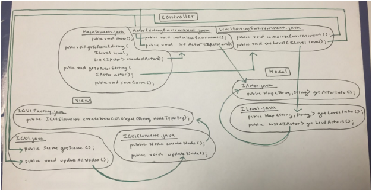
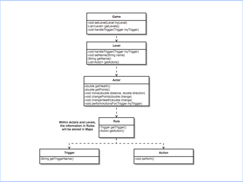
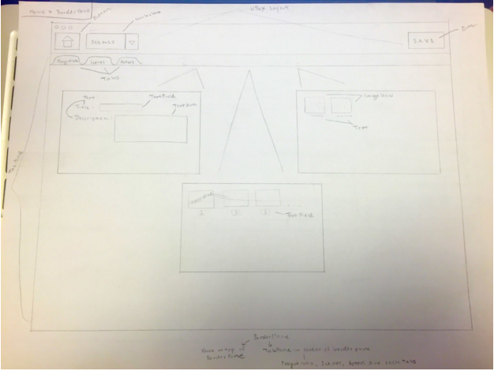
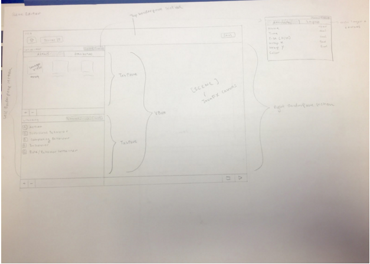
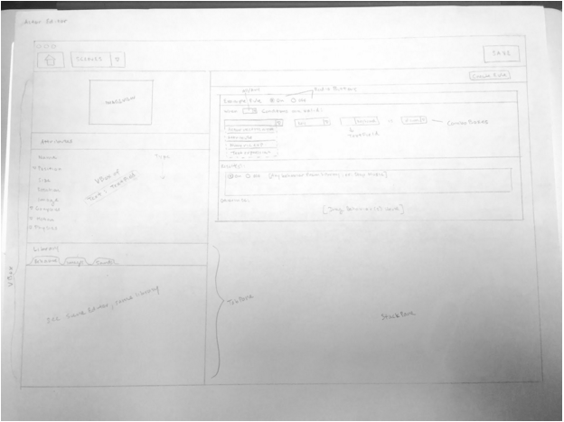

# VOOGASalad Design - The Loop's Goat Cheese Salad

*Justin Bergkamp, Michelle Chen, Michael Figueiras, Blake Kaplan, Stephen Kwok, Annie Tang, Carine Torres, Colette Torres, Bobby Wang, Amy Zhao*

## Introduction

This program is intended to allow users to run any type of scrolling platform game they create. The 2D scrolling platformer genre is unique in that it allows the scenes to scroll either vertically or horizontally and it allows actors in the scene to both be controlled by the player and interact with each other. Thus, our design will need to support flexibility in scrolling direction and a wide range of actor behaviors.

 Our primary design goals are to be as flexible as possible in letting users determine “rules” for their games, by means of some sort of trigger signal (e.g. a mouse click, a key press, a collision) and resulting executable action (e.g. move a character right, fire a missile from the character, etc.).  This means we will try to create a hierarchy for this architecture where the most fundamental components of the game are closed so as to very clearly define the role, say, a trigger plays in the flow of the game while allowing for their extension to support different types of triggers as games are designed to be more and more complex.  We will also try to make our design as flexible as possible to support the continueed addition of game objects to be rendered on the game screen by creating a hierarchy of object types that hold all basic properties required for their rendering on the screen and management as actors capable of potentially responding to triggers in the game and consequently executing actions.

## Design Overview

Our overall design is divided up into the game authoring environment, game engine, and game player/data.

#### Game Authoring Environment

The game authoring environment will be separated into three components, using the Model-View-Controller pattern.

**authoringenvironment.model**: This module contains the data representation of each Level and Actor the user creates. There are two Interfaces. The first is IActor.java, which is implemented by each Actor the user will create in the authoring environment (an Actor is any object in the game- whether it is an enemy, obstacle, etc. depends on the attributes the user decides on). It provides the user with an easy way to extract Actor information, especially when saving to an XML. This class contains one public method, `Map<String, String> getActorInfo()`, which returns a Map of actor properties in a predetermined format. The second Interface is ILevel, which is implemented by each Level the user creates or edits in the authoring environment. It contains one public method, `Map<String, String> getLevelInfo()`, which similar to `getActorInfo()`, gives the user an easy way to extract Level data/properties into an XML file. Also, there is a public method, `List<IActor> getLevelActors()`, which returns a List of Actors that each Level contains.

**authoringenvironment.view**: The purpose of this module is to contain all GUI code regarding JavaFX features and surface level visuals. There will be a parent interface called IGUIElement.java, which contains two public methods. The first is Node `createNode()`, to create the specified GUI element and return it as a Node. The second is void `updateNode()`, which updates the GUI feature as needed based on any new information. For example, the contents of a JavaFX ComboBox may need to be changed based on image files the user loads. This Interface will be implemented by many subclasses, each of which is separated by its JavaFX functionality. Visual features in the authoring environment will be created as extensions of these subclasses or as combinations of these subclasses. There will also be a GUIFactory class that utilizes the Factory design pattern to instantiate each of the GUI elements in this hierarchy. Finally, there will be an IGUI.java class that sends information from the view to the model, through the controller. Essentially, this class will set up the JavaFX Scene, which will be staged by the controller, which will pass this information to the model, where the data representation of the authoring environment will be updated based on the user input received by the view.

**authoringenvironment.controller**: This module allow for communication between the model and the view. It will contain three main Interfaces, which are separated based on different GUI views: ActorEditingEnvironment.java, LevelEditingEnvironment.java, and MainScreen.java. The actor editing environment is specific to allowing the user to create and edit “Actor” objects (see authoringenvironment.model), which can be obstacles, enemies, benign images, etc. This class contains two methods, one that initializes the actor editing environment, `void initiliazeEnvironment()`, and one that sets the Actor of the environment. Instead of creating multiple instances of this class, there will be a single Actor associated with the environment at any given time, which can be set, so the program knows which Actor it is currently creating or editing. LevelEditingEnvironment.java is the interface that all level editing environments must implement. The two methods in this Interface are `void initializeEnvironment()` and `void setLevel(ILevel level)`, which sets the Level of the environment. Similar to what we chose to do with the actor editing environment, instead of creating multiple instances of the level editing environment, there will be a single Level associated with the environment at any given time, which can be set, so the program knows which Level it is currently working on. Finally, MainScreen.java is the interface implemented by the main screen of the GUI. The method `void show()` may be called to display the screen, which contains options for the user to create/edit actors and levels, or to save the current state of their game into an XML file (`void saveGame()`). There are also two methods to either switch to the scene editing environment or the actor editing environment (`void goToSceneEditing(ILevel Level, List<IActor> createdActors`) and `void goToActorEditing(IActor actor)`)).

#### Game Engine

We divided up our game engine functionality into seven individual parts. The game engine is primarily broken up into a hierarchical structure of game to level to actor to rule to action/trigger and collision detection (see UML for more detail about module relation). We will now discuss individual module responsibilities in the context of their purpose with regards to the program's functionality and how they collaborate with each other, focusing specifically on each one's API:

**Game**: The game will be the main point of interaction between the Game Player and the Game Engine and will serve a purpose similar to a JavaFX Stage object. Essentially, the Game will hold all the different levels the user can be playing.

Since the Game will also be the point of interaction with the Game Player, it will be the pathway for relaying events. In our thinking, we acknowledged that there are some Actions that will occur with every timeline step. We will refer to these as “tick-triggered” Actions. Other Actions will be triggered by a specific user performed triggers such as key presses or mouse clicks. We decided to generalize these different events so that they are all treated in the same way. This way, it will be simple to create new Triggers, which will always be modular. When it receives a trigger of any sort, the Game passes it into the current Level object that is being played.

**Level**: Each level of the game will be represented on the back end as a Level object. In essence, each Level object is a package of Actor objects. As we see it, the a level will contain a map from Trigger to list of Actor objects. We chose to design it this way for a specific reason. Such a design prevents us from having to check each Actor’s rules with each timeline step. Especially for destination based games, performing such an O(n) operation would become very costly with computations. Instead, we decided that we would only reference Actors that respond to a specific Trigger for any given step. This saves us a great deal of computation.

The series of events upon receiving a Trigger object would be to first get the associated list of Actors. Then we would iterate over these Actors calling the `performActionsFor(Trigger myTrigger)` method. Doing so causes the Action response within each Actor. This design allows us to efficiently perform Actions that are specific to each Actor.

**Actor**: Each actor is essentially a package of Rules organized as a map. This map will have a Trigger as a key and a list of Action objects as a value. As we mentioned earlier, each Actor will contain a `performActionsFor(Trigger myTrigger)` method. This method will take in a Trigger, get the appropriate Action procedures from the map and loop over them to execute them.

This design allows us to keep the Triggers and the Actions very modular. Every object in the level will be represented by an Actor. When creating a game, a user can simply plug in Rule pairings to define Actor behaviors. Our design is conducive to a great deal of customization.

Furthermore, our Actor class will extend the ImageView class. This will allow us to easily attach visual elements to the Actor objects so that they can be easily displayed in the player. We plan to pass a list of Actors to be placed in the UI to the Game Player. A new set of objects to be displayed will be sent over with each step.

**Rule**: We decided to use a Rule class to hold pairs of Triggers and Actions. For our purposes this will help to keep these pairing together which is critical to functionality. In the Actors and Levels, we break these Rules down into maps, but for communication’s sake, the Rule objects will be useful.

**Action**: Any change that happens in a game work via Action objects. As described earlier, within an Actor, a Trigger is linked to a list of Action objects. Each Action will have a specific Actor passed into its constructor along with any necessary arguments to perform the Action. Actions are executed by calling the `perform()` method, which is common to each Action object. The Action will cause a change to the Actor, often via the `move(double distance, double direction)` method that the Actors will all have. The change will be reflected on the front end when it receives a Node with a different set of coordinates or exhibits a different change. We will be using at least one Action abstract class to place all shared functionality in a single place. Each Action object will extend the Action abstract class to inherit this predefined functionality.

**Trigger**: For all intents and purposes, our Triggers are Strings. However, we believe that making Triggers their own objects will allow us to perform further computation in the future. Perhaps, we will implement multi-conditional Action triggering. Each trigger simply has a `getTriggerName()` method. We will be using a Trigger abstract class and multiple subclasses in order to differentiate between the different types of Triggers. The Game Player will also instantiate Trigger objects when sending an event to the back end of the game.

**Collision Detection**: This object performs collision detection for each actor. Currently our plan is to split collisions into two kinds : benign and destroy. Each actor will contain a value relating its ‘deadliness’ and these values will be compared against the actor it collides with to determine which is destroyed. If the ‘deadliness’ value is neutral (probably just the integer 0) then the collision will be ruled benign. This distinction allows us to create multiple interactions between actors (ie player vs obstacle or player vs enemy). The system of comparing ‘deadliness’ values also allows us to create actors that have higher ratings than enemies, which can be used as weapons. Should our game contain Power Ups for invincibility or less damage, they could implemented as an increase to a player’s deadliness value.

## User Interface

#### Authoring Environment

The authoring environment's user interface is separated into three main screens. The first is the main screen, where the user will see multiple tabs leading to either the project info (title, description, etc.), current scenes/Levels, and available Actors. Within the scenes/levels tab, the user can double click on the scene/level to enter the level editing environment. Within the Actors tab, the user can double click on the Actor to enter the Actor editing environment. The toolbar at the top will be present for all views of the GUI, where the user can return to “home”, i.e. this main screen, look at a drop down menu of current scenes, or save the progress of their design.

This second image shows the Level editing environment. On the left pane is an inspector section, which is separated into two tabs: Game and Scene. In each tab, the user can see attributes of either the game or the scene. The user can also view available Actors that will be able to be clicked and dragged onto the screen in the right pane. Below the inspector section is a library of behaviors, actions, and rules that the user can implement in their game, as well as images they can load as Actors and mp3s they can load as sounds. The +/- buttons below the inspector and the library allow the user to either add a new actor or add new objects to the library. The right pane of the Level editing environment is where the user can add items and view their design as it is created. There will also be a stop and play button below this pane where the user can simulate their game as it is.

Finally, the third image shows the Actor editing environment. On the left pane, the user can see the image that the Actor is represented by, as well as its attributes (name, position, size, etc.). Below this is the same library that was in the scene editing environment. On the right pane of this environment is where the user can click and drag combinations of rules and behaviors that the Actor must adhere to.

## Design Details

#### Authoring Environment

**authoringenvironment.model**: The model component of the authoring environment sets and updates the settings for each actor and level in responses to the user’s interaction with the UI. The information that the model holds includes the placement of game elements, the order of level advancement, placement of graphical elements, reactions, and instructions. It also provides an easy way of saving this information via the ILevel and IActor interfaces’ `getInfo()` methods so that the data can be stored and re-loaded to either play or continue editing. By collaborating with the MainScreen in the controller module to store all of this information in a centralized location, and with the UI elements in the view module to obtain the user’s selections, its organization and generality allows for flexible creation of actors and levels that can be easily loaded into the game engine. The model can be extended to support new actions in response to triggers for actors, and to modify more features of the levels by adding more options to the comboboxes and other UI components that the user will interact with.

**authoringenvironment.view**: The view component of the authoring environment lays out what the designer sees as the user interface, based on information gleaned from the model. The view will contain all GUI code regarding JavaFX features and surface level visuals. It will control the placement of the GUI elements such as ComboBoxes, TextFields, Buttons, popup Dialogs, error messages, TableViews, ImageViews, and so on, through an inheritance hierarchy of GUI elements. The view will also determine the layout of the GUI regarding uses of BorderPanes and TabPanes and how each component of the GUI will be nested within each other. To do all this, there will be a parent interface called IGUIElement.java, which contains two public methods. The first is Node createNode(), to create the specified GUI element and return it as a Node. The second is void updateNode(), which updates the GUI feature as needed based on any new information. For example, the contents of a JavaFX ComboBox may need to be changed based on image files the user loads. This Interface will be implemented by many subclasses, each of which is separated by its JavaFX functionality. Visual features in the authoring environment will be created as extensions of these subclasses or as combinations of these subclasses. There will also be a GUIFactory class that utilizes the Factory design pattern to instantiate each of the GUI elements in this hierarchy. The view also sets up the user interface as a Scene within an IGUI.java class that sends information from the view to the model, through the controller. Essentially, this class will set up the JavaFX Scene, which will be staged by the controller, which will pass this information to the model, where the data representation of the authoring environment will be updated based on the user input received by the view.

**authoringenvironment.controller**

The MainScreen module serves as the controller for the authoring environment and allows the user to add or edit actors and levels as well as return to the overall program’s main screen. The ActorEditingEnvironment module allows the user to either edit a currently existing actor or create a new one. The LevelEditingEnviroment module allows the user to either edit a currently existing actor or create a new one. We decided to create these three separate modules for the controller component of the authoring environment so as to ensure each class only fulfills a single responsibility.

## Example Games

**Flappy Bird**

In the game Flappy Bird, the user attempts to dodge obstacles by moving an actor up and down as the screen scrolls horizontally until a collision occurs between the actor and an obstacle. The game authoring environment allows for this type of game by giving the author the option to generate an infinitely-scrolling scene within the level editing environment. The author then has the option of dragging and dropping actors created in the actor editing environment into that scene or level. The author may also decide how frequently each actor appears on that level (as it would be impossible for the author to place obstacles indefinitely). Each of the actors will come with a set of defined rules for responding to given triggering events (this will be implemented as a Rules class with a TriggerEvent that results in the invoking of an Action). In the case of Flappy Bird, the actors to be created will include the user-controlled player and obstacles such as pipes. Each obstacle will likely have a single Rule, stating that whenever the TriggerEvent Collision occurs between the user and the obstacle, the GameEnd Action is invoked. For the user-controlled player, a Rule specific to that actor may be that whenever the trigger event KeyPressUp occurs, the MoveUp Action is invoked. Any other responses to events such as mouse clicks, key presses, or collisions, can be added to an Actor’s list of rules in this way. Then, when the game runs, each game loop will involve iterating through each actor’s list of Rules to check for TriggerEvents and making any responses happen as needed.

**Super Mario**

In the game Super Mario, the user traverses a predefined scene until he or she reaches some destination that enables him or her to advance to the next level. Along the way, the user must break down obstacles, defeat enemies, and watch out for traps. Super Mario differs from Flappy Bird in that the scene does not scroll indefinitely. Rather, there is a set ending point and every obstacle on a given level must be added manually by the author. The author will be given the option to build whole levels in the level editing environment. From there, creation of the scene is exactly the same as it is for Flappy Bird. The level editing environment will display actors the author has already created, and those actors simply need to be dragged and dropped into the desired location on the scene. One difference between Super Mario and Flappy Bird is that Super Mario consists of multiple levels instead of just one. To accommodate this, the Game Authoring Environment will have a Main Screen that allows the author to see all currently created levels and actors. By clicking on any level, the author will then be sent to the level editing environment to edit the level he or she clicked on. The Main Screen will also have buttons allowing the author to create new levels or actors. Having multiple levels also means the Game Engine needs some way of knowing when to switch scenes. To account for this, the author can define some actor that serves as the target destination which has the Rule that when the user and target collide, the NextLevel Action is invoked.

Our game engine design enables this type of game with level progression through our very extensible hierarchy of game objects that can engage in a variety of triggers for a wide range of resulting actions.  For example, by extending our Actor class, we could create, say, an InvisibleActor class and place it at the end of the level’s scene such that when the main character actor collides with this invisible actor object, the collision (Collision could be an extension of our Trigger class) triggers a level change (LevelChange could be an extension of our Action class).

The HUD will display an outline of the route for the level with the main target being the user’s player and the end of the route will coincide with the location of the target actor that, upon collision, will transition to the next level. This way the user will be able to determine how far they are from the end of the level. In terms of design, the HUD will be an observer of the game engine’s player location and will update its relative position according to the ratio of the player’s x location to the final destination or actor’s x location. This is supported by our design with the update() method of the HUDScreen class and is compatible with the GameLoop.

**Doodle Jump**

Doodle Jump is similar to Flappy Bird in that both require infinite scrolling. However, Doodle Jump scrolls vertically instead of horizontally, which the Game Authoring Environment will enable. Another difference is that projectiles are present in Doodle Jump. To account for this, the actor editing environment will allow authors to create the projectile with attributes and Rules as with any other actor. However, the actor will not be dragged and dropped into a scene in the level editing environment. Rather, the initial position of the projectile will be determined by the Game Engine while the game is running.

Our design enables this type of initely scrolling game with an action occurring at a regular interval because of our flexible Trigger and Actions classes.  As in Flappy Bird, we could make use of a Tick subclass of Trigger contained in our main character actor and constantly trigger Tick at every step through our game loop, then have Tick map to a Jump subclass of Action.  At the same time, every other actor (besides the main character and potentially background) would contain a rule mapping a Tick trigger to a MoveDown action.  The MoveDown action’s perform() method would be set to move the actor down some constant so that it appears as if the game is scrolling down.

With regards to the design of the game data aspect, our XML saver will still allow for the functionalities specific to Doodle Jump.  To address the behaviors particular to Doodle Jump (i.e. a collision with other actors doesn't mean "game over" like it does in Flappy Bird...a player landing on one of the actors actually means the opposite, that the game should continue), merely, the rules property file referred to in an actor's section in the XML file will simply be different for Doodle Jump versus Flappy Bird or Mario.  That rules property file would also catch the unique scrolling of Doodle Jump that has movement occur with "up" and "down" keys because those would be the keys corresponding to movement actions in the file (rather than "left" and "right" keys, say). The XML creator only writes in a filepath given by the authoring environment, so the avoidance of hardcoding of a file allows for an acknowledgement of behaviors specific to Doodle Jump.  The design choice to use property files to connect interactions with executionable behaviors also facilitates that flexibility because reflection can then be used to generically execute game behaviors regardless of the actual TriggerEvent/Action pair.  The unique background for Doodle Jump would be acknowledged in the establishment of a "background-image" section in each level's section created by the XML creator too.

Our design of the game player also facilitates Doodle Jump's unique functionalities. In particular, the infinite scrolling capability is supported by the game player's design inclusion of a game loop since the portion of the game loop that "updates" "checks interactions" and "cleans up" the screen will allow actors and backgrounds to appear to be scrolling by merely cycling through different x and y position on the screen.  Those changes are rendered by that latter portion of the game loop.  

## Design Considerations

#### Authoring Environment

In designing our authoring environment, our main concerns were where to store information about the actors and levels that the user creates, and how to store them in a format that allows them to be easily saved and loaded into the game engine.

We wanted to create a class that provided a common point of access to all the level and actor information so that the Game Data group could save all necessary information easily and to minimize dependencies between the authoring environment and other components. Two options we considered were to create a AuthoredData class that held the information, or to store it in the MainScreen class. While an AuthoredData class could possibly make our design more readable, it is also not very functionally useful to have a class that does little more than hold data, which is why in the end we decided to have each Actor store its own information, and each Level store its own information, but keep references to each ILevel within the MainScreen, as well as references to all IActors, and have each ILevel have references to every IActor that has been added to it.

We also discussed at length how we would store the information within each level and within each actor.
For returning information such as name, image, size, etc., we considered returning them as Lists of Strings or as Maps of property to setting (String to String) and ultimately decided that storing info as Maps would minimize dependencies between the authoring environment and game data since there is no need to agree upon a particular order as there would be if we returned a single String. We also decided that for Rules, we would set strings corresponding to Triggers and Actions via properties files that would match an option with the class name that the Game Engine decides on so that they can use reflection to create the Trigger and Action pairings.

In this preparation process, we had several conversations about the interpretation of XML data and how to pass this information to the GameAuthoringEnvironment. We initially felt the need to be able to parse the data by information category and then format it to the GameAuthoringEnvironment’s specifications of a map of information attributes and a list of actors. However, this limits the extension potential of this component. After Professor Duvall introduced us to xstream, we opted to try this feature since it allows us to save and read data in as objects that have their own attributes. This way, extension is made simple with the capability of adding new information to the object class. In addition, we will continue to interact with the GameAuthoringEnvironment through a map and list.

#### Game Engine

As explained above, our Game Engine design centers around a collection of Actors, each possessing a link from a Trigger to an Action. Much of our team decision focussed on what would constitute a Trigger and the method through which our game engine could evaluate whether the Triggers had been prompted.

The initial idea was to cycle through every Trigger for each Actor in the level, evaluating each. After discussion, we decided that this method would be excessive and that only checking the relevant Actors would be best. To this end, we decided on creating a map linking each Triggers to all of the Actors that possess an action for that Trigger. Map <Trigger, List<Actors>>. This cuts down on the amount of processing that the Game Engine must do, as each Trigger can directly call the actions for each affected Actor. This layout necessitates a separate collision detection process, however, since the Game Player has no collision detection capabilities. This system also means that the game loop must be contained within the Game Player in order for the map to receive the animation step ‘tick’ as a Trigger.  
